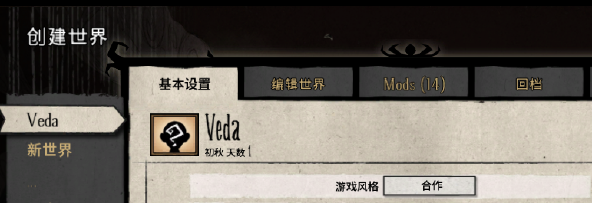

title: "饥荒Don't starve together Mac独立服务器搭建"
date: 2017-03-03 19:08:03
tags: [Game]
---

## 购买正版饥荒
## 创建世界
1. 先创建好世界（进去一次地图后再退出来）。
2. 再次进入，看看你建立的世界是第几个世界。（此时为第一个）
 

<!--more-->

3. 在刚登入游戏的界面，点击右下角的“个人资料”（应该是左起第二个），会弹出来一个页面。随机生成一个专用服务器令牌（下图马赛克中的部分），记录下来。


准备工作做完了，剩下的是配置过程。

## 配置
###建立验证文件（估计是为了防盗版）
先找到你刚刚创建的那个世界的文件夹，Mac下在`~/Documents/Klei/DoNotStarveTogether/`中，跳转至这个文件夹。
```bash
cd ~/Documents/Klei/DoNotStarveTogether/
```


 这个文件夹下应该有多个文件`Cluster_1`, `Cluster_2`等等。我刚刚创建的是第一个世界，这就应该是`Cluster_1`，跳转进这个文件夹。
```bash
cd Cluster_1
```

建立文件`cluster_token.txt`并把刚刚的专用服务器令牌(your_token替换为你的token)写进文件中。
```bash
echo your_token > cluster_token.txt
```

### 创建启动脚本
跳转DST提供的独立服务器的脚本目录。
```bash
cd ~/Library/Application Support/Steam/steamapps/common/Don't Starve Together/dontstarve_steam.app/Contents/MacOS
```
该目录下`dontstarve_dedicated_server_nullrenderer`这个文件，是DST提供的独立服务器的执行文件。
写两个脚本文件分别用来生成地上和洞穴的服务器。
```bash
echo "./dontstarve_dedicated_server_nullrenderer -console -cluster Cluster_\$1 -shard Master" > start.sh && chmod +x start.sh

echo "./dontstarve_dedicated_server_nullrenderer -console -cluster Cluster_\$1 -shard Caves" > start_cave.sh && chmod +x start_cave.sh
```

 然后执行脚本文件`./start.sh id`,  id就是你地图的编号，再进入游戏就能找到地图了（不是在创建世界中，在寻找房间里。如果你是本机上搭建的服务器，那就在本地找。其他人照常在服务器上找。）

**注意，先打开游戏以后再建立服务器。** 我先建立服务器再进游戏就进不去了，不知道是不是我的个例。

## 快速启动脚本
之前的步骤已经足够搭建服务器了。但是如果不想每次都生成一下验证文件还专门跳转到启动脚本的文件夹，可以按我下面写的脚本快速启动（放在哪里都行，记着替换里面的token）。

```bash
if [ $# -lt 1 ]; then
	echo "Need cluster id"
else
	path=~/Documents/Klei/DoNotStarveTogether/Cluster_$1
	cd $path
	echo "your_token" > cluster_token.txt //替换你的token

	cd ~/Library/Application\ Support/Steam/steamapps/common/Don\'t\ Starve\ Together/dontstarve_steam.app/Contents/MacOS
	sh start.sh $1 1 > /dev/null &
	echo "Start to run cluster"

	if [ $# -eq 2 -a $2 = 'Y' ]
		then
			sh start_cave.sh $1 > /dev/null &
			echo "Start to run cave"
		else
			echo "Didn't run cave"
	fi
fi
```

启动时候只需执行:
> `sh DST_start.sh id` (只生成地上)
> `sh DST_start.sh id Y` (同时生成地上和洞穴地图)


